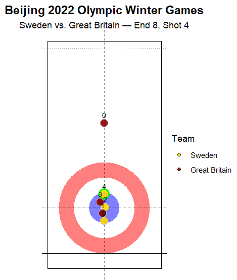
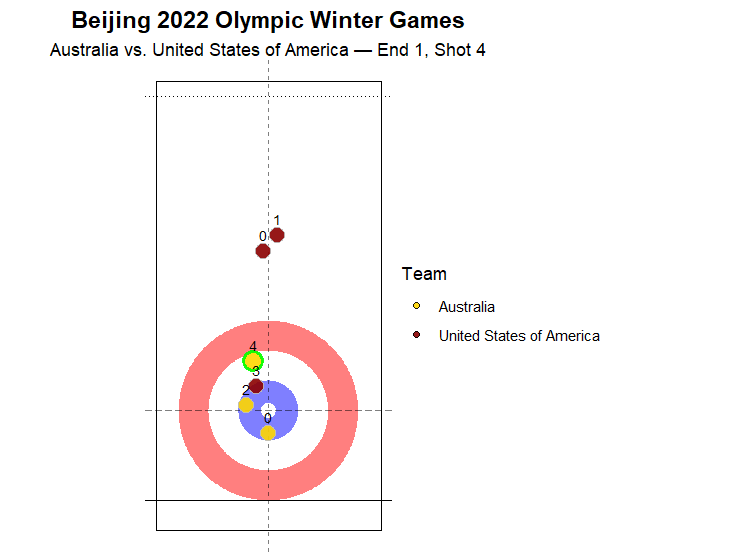
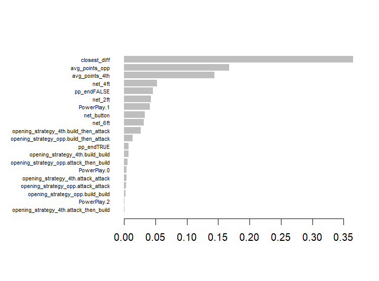

# Opening-State Modeling of End Outcomes in Mixed Doubles Curling

James Chen & Charlie Ko, 12/5/2025

---

## 1. Problem Statement
In a competitive mixed doubles curling match, the opening plays can quietly shape the final scoring outcome for each end, even though it is hard to tell who is truly leading after only a few  shots. This study aims to identify which early features and strategies most strongly contribute to score in an end, in both Power Play and normal situations, using stone-level data. In particular, we investigate how execution quality, shot selection, and stone position control (e.g., inner-ring/2-ft control) affect end outcomes, and how teams should develop opening strategies to maximize their winning probability for each end, both with or without the hammer.

<p align="center">
  
  
  <br>
  <em>Figure 1. Two visually similar fourth-shot states with opposite results. Despite comparable early end positions, the team with the hammer loses the end in Sweden vs. Great Britain (left) but wins in Australia vs. United States (right).</em>
</p>

**Curling rules can be found [here](https://worldcurling.org/about/curling/).**

---

## 2. Data and Methodology

### 2.1  Reconstructing End States From Stone-Level Data

The data were collected from games played in the 2026 Connecticut Sports Analytics Symposium competition, downloaded from this [GitHub](https://github.com/CSAS-Data-Challenge/2026) page. Starting from the Stones.csv dataset, we first assign a shot order number within each end, then join this information with Ends.csv to determine whether the end is a power play. Because the team that throws second in an end holds the hammer, identifying the team that throws first allows us to infer hammer ownership for that end.

<details>
<summary><strong>Library</strong></summary>

<br>

```r
library(dplyr)
library(tidyverse)
library(ggplot2)
library(ggforce)

library(lme4)
library(mgcv)

library(caret)
library(xgboost)
library(pROC)

competition  <- read.csv("Competition.csv",  stringsAsFactors = FALSE)
competitors  <- read.csv("Competitors.csv",  stringsAsFactors = FALSE)
ends         <- read.csv("Ends.csv",         stringsAsFactors = FALSE)
games        <- read.csv("Games.csv",        stringsAsFactors = FALSE)
stones       <- read.csv("Stones.csv",       stringsAsFactors = FALSE)
teams        <- read.csv("Teams.csv",        stringsAsFactors = FALSE)

Stones_plus <- stones %>%
  group_by(CompetitionID, SessionID, GameID, EndID) %>%
  arrange(ShotID, .by_group = TRUE) %>%
  mutate(n_stone_thrown = row_number()) %>%
  ungroup()

Stones_plus <- Stones_plus %>%  
  left_join(ends) %>% 
  mutate(PowerPlay = ifelse(is.na(PowerPlay), 0, PowerPlay)) %>% 
  group_by(CompetitionID, SessionID, GameID, EndID) %>% 
  mutate(pp_end = sum(PowerPlay) > 0) %>% 
  ungroup()

#find which team throws first
end_first <- Stones_plus |>
  group_by(CompetitionID, SessionID, GameID, EndID) |>
  slice_min(ShotID, n = 1, with_ties = FALSE) |>
  summarise(
    team_first = first(TeamID),
    .groups = "drop"
  )

# all teams appearing in each end
end_team_ids <- Stones_plus |>
  distinct(CompetitionID, SessionID, GameID, EndID, TeamID)

# map each end to team_first and team_second
end_teams <- end_team_ids |>
  left_join(end_first,
            by = c("CompetitionID", "SessionID", "GameID", "EndID")) |>
  group_by(CompetitionID, SessionID, GameID, EndID) |>
  summarise(
    team_first  = first(team_first),
    team_second = TeamID[TeamID != first(team_first)][1],
    .groups = "drop"
  )

# attach to Stones_plus
Stones_plus <- Stones_plus |>
  left_join(end_teams,
            by = c("CompetitionID", "SessionID", "GameID", "EndID"))
```
</details>

Scoring in curling depends on which team has the stone closest to the button. Using the stone coordinates in Stones.csv, we compute the distance from each stone to the button. From these distances, we determine (i) which team is currently in the scoring position, (ii) how many of that team’s stones lie closer to the button than the opponent’s nearest stone, and (iii) the number of stones in each scoring ring (button, 2-foot, 4-foot, and 6-foot). These derived features summarize the scoring landscape for each end.


<details>
<summary><strong>Generate distance function and other columns</strong></summary>

<br>

```r
#stone distance from the target
stone_dist <- function(x, y) {
  out_of_play <- x %in% c(0, 4095) | y %in% c(0, 4095)
  d <- sqrt((x - 750)^2 + (y - 800)^2)
  d[out_of_play] <- NA_real_
  d
}

Stones_plus <- Stones_plus |>
  mutate(
    stone_1_dist  = stone_dist(stone_1_x,  stone_1_y),
    stone_2_dist  = stone_dist(stone_2_x,  stone_2_y),
    stone_3_dist  = stone_dist(stone_3_x,  stone_3_y),
    stone_4_dist  = stone_dist(stone_4_x,  stone_4_y),
    stone_5_dist  = stone_dist(stone_5_x,  stone_5_y),
    stone_6_dist  = stone_dist(stone_6_x,  stone_6_y),
    stone_7_dist  = stone_dist(stone_7_x,  stone_7_y),
    stone_8_dist  = stone_dist(stone_8_x,  stone_8_y),
    stone_9_dist  = stone_dist(stone_9_x,  stone_9_y),
    stone_10_dist = stone_dist(stone_10_x, stone_10_y),
    stone_11_dist = stone_dist(stone_11_x, stone_11_y),
    stone_12_dist = stone_dist(stone_12_x, stone_12_y)
  )
foot_to_units <- 100

r_6ft   <- 6   * foot_to_units  # 600  (outer house)
r_4ft   <- 4   * foot_to_units  # 400
r_2ft   <- 2   * foot_to_units  # 200
r_6inch <- 0.5 * foot_to_units  # 50   (button)

Stones_plus <- Stones_plus |>
  mutate(
    # ---- team that throws first: stones 1–6 ----
    n_button_first = rowSums(
      cbind(
        stone_1_dist <= r_6inch,
        stone_2_dist <= r_6inch,
        stone_3_dist <= r_6inch,
        stone_4_dist <= r_6inch,
        stone_5_dist <= r_6inch,
        stone_6_dist <= r_6inch
      ),
      na.rm = TRUE
    ),
    n_2ft_first = rowSums(
      cbind(
        stone_1_dist > r_6inch & stone_1_dist <= r_2ft,
        stone_2_dist > r_6inch & stone_2_dist <= r_2ft,
        stone_3_dist > r_6inch & stone_3_dist <= r_2ft,
        stone_4_dist > r_6inch & stone_4_dist <= r_2ft,
        stone_5_dist > r_6inch & stone_5_dist <= r_2ft,
        stone_6_dist > r_6inch & stone_6_dist <= r_2ft
      ),
      na.rm = TRUE
    ),
    n_4ft_first = rowSums(
      cbind(
        stone_1_dist > r_2ft & stone_1_dist <= r_4ft,
        stone_2_dist > r_2ft & stone_2_dist <= r_4ft,
        stone_3_dist > r_2ft & stone_3_dist <= r_4ft,
        stone_4_dist > r_2ft & stone_4_dist <= r_4ft,
        stone_5_dist > r_2ft & stone_5_dist <= r_4ft,
        stone_6_dist > r_2ft & stone_6_dist <= r_4ft
      ),
      na.rm = TRUE
    ),
    n_6ft_first = rowSums(
      cbind(
        stone_1_dist > r_4ft & stone_1_dist <= r_6ft,
        stone_2_dist > r_4ft & stone_2_dist <= r_6ft,
        stone_3_dist > r_4ft & stone_3_dist <= r_6ft,
        stone_4_dist > r_4ft & stone_4_dist <= r_6ft,
        stone_5_dist > r_4ft & stone_5_dist <= r_6ft,
        stone_6_dist > r_4ft & stone_6_dist <= r_6ft
      ),
      na.rm = TRUE
    ),

    # ---- team that throws second: stones 7–12 ----
    n_button_second = rowSums(
      cbind(
        stone_7_dist  <= r_6inch,
        stone_8_dist  <= r_6inch,
        stone_9_dist  <= r_6inch,
        stone_10_dist <= r_6inch,
        stone_11_dist <= r_6inch,
        stone_12_dist <= r_6inch
      ),
      na.rm = TRUE
    ),
    n_2ft_second = rowSums(
      cbind(
        stone_7_dist  > r_6inch & stone_7_dist  <= r_2ft,
        stone_8_dist  > r_6inch & stone_8_dist  <= r_2ft,
        stone_9_dist  > r_6inch & stone_9_dist  <= r_2ft,
        stone_10_dist > r_6inch & stone_10_dist <= r_2ft,
        stone_11_dist > r_6inch & stone_11_dist <= r_2ft,
        stone_12_dist > r_6inch & stone_12_dist <= r_2ft
      ),
      na.rm = TRUE
    ),
    n_4ft_second = rowSums(
      cbind(
        stone_7_dist  > r_2ft & stone_7_dist  <= r_4ft,
        stone_8_dist  > r_2ft & stone_8_dist  <= r_4ft,
        stone_9_dist  > r_2ft & stone_9_dist  <= r_4ft,
        stone_10_dist > r_2ft & stone_10_dist <= r_4ft,
        stone_11_dist > r_2ft & stone_11_dist <= r_4ft,
        stone_12_dist > r_2ft & stone_12_dist <= r_4ft
      ),
      na.rm = TRUE
    ),
    n_6ft_second = rowSums(
      cbind(
        stone_7_dist  > r_4ft & stone_7_dist  <= r_6ft,
        stone_8_dist  > r_4ft & stone_8_dist  <= r_6ft,
        stone_9_dist  > r_4ft & stone_9_dist  <= r_6ft,
        stone_10_dist > r_4ft & stone_10_dist <= r_6ft,
        stone_11_dist > r_4ft & stone_11_dist <= r_6ft,
        stone_12_dist > r_4ft & stone_12_dist <= r_6ft
      ),
      na.rm = TRUE
    )
  )

# which team is in the scoring postition 
Stones_plus <- Stones_plus |>
  rowwise() |>
  mutate(
    # closest stone for team_first (stones 1–6)
    closest_first = min(
      c_across(c(stone_1_dist, stone_2_dist, stone_3_dist,
                 stone_4_dist, stone_5_dist, stone_6_dist)),
      na.rm = TRUE
    ),
    # closest stone for team_second (stones 7–12)
    closest_second = min(
      c_across(c(stone_7_dist, stone_8_dist, stone_9_dist,
                 stone_10_dist, stone_11_dist, stone_12_dist)),
      na.rm = TRUE
    ),
    # if all distances are NA for a side, min(..., na.rm=TRUE) is Inf -> set to NA
    closest_first  = ifelse(is.infinite(closest_first),  NA_real_, closest_first),
    closest_second = ifelse(is.infinite(closest_second), NA_real_, closest_second),

    scoring_team_order = case_when(
      !is.na(closest_first)  & (is.na(closest_second) | closest_first <= closest_second) ~ "first",
      !is.na(closest_second) & (is.na(closest_first)  | closest_second <  closest_first) ~ "second",
      TRUE ~ NA_character_
    ),
    scoring_teamID = case_when(
      scoring_team_order == "first"  ~ team_first,
      scoring_team_order == "second" ~ team_second,
      TRUE ~ NA_integer_
    )
  ) |>
  ungroup()
Stones_plus <- Stones_plus |>
  rowwise() |>
  mutate(
    # How many FIRST team stones are closer than second's best stone?
    n_first_closer_than_second = if (!is.na(closest_second)) {
      sum(c_across(c(stone_1_dist, stone_2_dist, stone_3_dist,
                     stone_4_dist, stone_5_dist, stone_6_dist)) < closest_second,
          na.rm = TRUE)
    } else {
      NA_integer_
    },

    # How many SECOND team stones are closer than first's best stone?
    n_second_closer_than_first = if (!is.na(closest_first)) {
      sum(c_across(c(stone_7_dist, stone_8_dist, stone_9_dist,
                     stone_10_dist, stone_11_dist, stone_12_dist)) < closest_first,
          na.rm = TRUE)
    } else {
      NA_integer_
    },

    projected_points_scoring = case_when(
      scoring_team_order == "first"  ~ n_first_closer_than_second,
      scoring_team_order == "second" ~ n_second_closer_than_first,
      TRUE ~ NA_integer_
    )
  ) |>
  ungroup()
```
</details>

### 2.2 Feature Engineering and Modeling Dataset Construction

After reconstructing end states, we focus on a consistent point in every end: the situation immediately after the fourth shot, which is always thrown by the team with the hammer. This moment captures the early structure of the end, including both teams’ intentions and the emerging scoring landscape. To describe how each end begins, we summarize the first two shots taken by each team. The Task variable labels the intended purpose of a shot, and we use it to classify early shots into broader strategic categories.

Curling usually involves two broad kinds of actions. Build-oriented shots, such as draws and guards, are meant to establish position, create cover, or shape the house in a way that sets up future scoring. These shots rarely involve direct contact with opposing stones. Attack-oriented shots, such as takeouts, hits, tap-backs, and peeling actions, aim to remove or disturb opponent stones and immediately alter the scoring environment. Using this grouping, we map each team’s first two shots into one of four opening sequences: build_build, attack_attack, build_then_attack, and attack_then_build. We also summarize execution quality by averaging the judged shot score (0 to 4) across those two shots.

<details>
<summary><strong>Extract opening strategies</strong></summary>

<br>

```r
stones_type <- Stones_plus %>%
  mutate(
    task_type = case_when(
      Task %in% c(0, 5)           ~ "draw",        # Draw, Freeze
      Task %in% c(1, 2)           ~ "guard",       # Front, Guard
      Task %in% c(6, 7, 8, 9, 10) ~ "hit",         # Take-out variants, clearing
      Task %in% c(3, 4)           ~ "tap_soft",    # Raise / Tap-back, Wick / Soft peel
      Task == 11                  ~ "through",
      Task == 13                  ~ "nostat",
      TRUE                        ~ "other"
    )
  )

opening_by_team_end <- stones_type %>%
  group_by(CompetitionID, SessionID, GameID, EndID, TeamID) %>%
  arrange(ShotID, .by_group = TRUE) %>%
  dplyr::slice(1:2) %>%                       # first two stones this team throws in this end
  summarise(
    first_type  = first(task_type),
    second_type = nth(task_type, 2),
    opening_pair  = paste(first_type, second_type, sep = "_"),
    opening_strategy = case_when(
      first_type  %in% c("draw", "guard") &
      second_type %in% c("draw", "guard") ~ "build_build",        # both stones building

      first_type  %in% c("hit", "tap_soft") &
      second_type %in% c("hit", "tap_soft") ~ "attack_attack",    # both stones attacking

      first_type  %in% c("draw", "guard") &
      second_type %in% c("hit", "tap_soft") ~ "build_then_attack",

      first_type  %in% c("hit", "tap_soft") &
      second_type %in% c("draw", "guard") ~ "attack_then_build",

      TRUE ~ "other"
    ),

    # execution summary
    avg_points   = mean(Points, na.rm = TRUE),
    min_points   = min(Points, na.rm = TRUE),
    .groups = "drop"
  )
```
</details>


To build the fourth-shot dataset, we extract the row in Stones_plus that corresponds to the fourth shot in each end and join onto it the opening sequence and execution measures for both teams. This results in a compact description of how each end has unfolded up to that moment from both the hammer team and the opponent.
We then engineer a set of features that summarize the board state at the time of the fourth shot. Using the ring-level reconstructions from Section 2.1, we convert the raw counts into relative measures from the hammer team’s perspective. These include net differences in stone counts across scoring rings and the difference in each team’s closest stone to the button. When a team has no stone in play, a large, fixed placeholder distance is used so that comparisons remain valid.

<details>
<summary><strong>Narrow down to fourth_shot dataset</strong></summary>

<br>

```r
# Extract 4th shot in each end
fourth_shot <- Stones_plus %>%
  filter(n_stone_thrown == 4) %>% 
  rename(TeamID_4th = TeamID,
         score_diff = point_diff)   

# Add opening strategy for the 4th-shot team
fourth_shot <- fourth_shot %>%
  left_join(
    opening_by_team_end %>%
      rename(
        TeamID_4th          = TeamID,
        first_type_4th    = first_type,
        second_type_4th   = second_type,
        opening_pair_4th    = opening_pair,
        opening_strategy_4th = opening_strategy,
        
        avg_points_4th = avg_points,
        min_points_4th = min_points
      ),
    by = c("CompetitionID", "SessionID", "GameID", "EndID", "TeamID_4th")
  )

# Add opponent opening strategy with a second join
fourth_shot <- fourth_shot %>%
  # join opening info for *all* teams in that end
  left_join(
    opening_by_team_end %>%
      rename(
        OppTeamID             = TeamID,
        first_type_opp        = first_type,
        second_type_opp       = second_type,
        opening_pair_opp      = opening_pair,
        opening_strategy_opp  = opening_strategy,
        
        avg_points_opp = avg_points,
        min_points_opp = min_points
      ),
    by = c("CompetitionID", "SessionID", "GameID", "EndID")
  ) %>%
  # keep only the row where OppTeamID is actually the *other* team
  filter(OppTeamID != TeamID_4th)

# Add some net columns 
# (second - first) since we are using the perspective of hammer team.
MAX_DIST <- 4095 # assigned a large dist for all stones out-of-play situation

fourth_shot <- fourth_shot %>% 
  mutate(net_button = n_button_second - n_button_first,
         net_2ft = n_2ft_second - n_2ft_first,
         net_4ft = n_4ft_second - n_4ft_first,
         net_6ft = n_6ft_second - n_6ft_first,
         net_house = net_2ft + net_4ft + net_6ft,
         closest_first  = if_else(is.na(closest_first),  MAX_DIST, closest_first),
         closest_second = if_else(is.na(closest_second), MAX_DIST, closest_second),
         closest_diff   = closest_first - closest_second) # positive = better
```
</details>

Finally, we attach end outcomes to each fourth-shot record. These include the hammer’s scoring margin, whether the hammer won the end, and whether the hammer earned a two-point or larger end. Rare opening types are removed to avoid unstable modeling. The resulting dataset, referred to as model_df, contains the core strategic variables, execution summaries, engineered board-state features, and outcomes. It serves as the modeling dataset for analyses in the later sections.

<details>
<summary><strong>Construct model_df dataset, ready for model fitting</strong></summary>

<br>

```r
model_df <- fourth_shot %>%
  # some light recoding / extra targets
  mutate(
    opening_strategy_4th = factor(opening_strategy_4th),
    opening_strategy_opp = factor(opening_strategy_opp),
    pp_end               = as.logical(pp_end),
    PowerPlay            = factor(PowerPlay),   # if coded 0/1/2 or "", 1, 2
    win_end              = as.integer(score_diff > 0),   # hammer team scores
    big_end              = as.integer(score_diff >= 2)   # 2+ points for hammer
  ) %>%
  select(
    # IDs
    CompetitionID, SessionID, GameID, EndID,
    TeamID_4th, OppTeamID,

    # Strategy (both teams)
    opening_strategy_4th, opening_strategy_opp,
    first_type_4th,  second_type_4th,
    first_type_opp,  second_type_opp,
    PowerPlay, pp_end,

    # Board state: zone counts (raw)
    n_button_first, n_button_second,
    n_2ft_first,    n_2ft_second,
    n_4ft_first,    n_4ft_second,
    n_6ft_first,    n_6ft_second,
    closest_first,  closest_second,

    # Board state: net summaries
    net_button, net_2ft, net_4ft, net_6ft,
    net_house, closest_diff,

    # Execution quality of first two stones
    avg_points_4th, min_points_4th,
    avg_points_opp, min_points_opp,

    # Outcomes
    score_diff, win_end, big_end
  )

# Remove "other" cases (size too small)
model_df <- model_df %>%
  filter(
    opening_strategy_4th != "other",
    opening_strategy_opp != "other"
  )
```
</details>

  


### 2.3 Model Design & Developement

With the modeling dataset constructed at the fourth-shot state of each end, our goal is to understand how opening strategies, execution quality, and early board position relate to scoring outcomes. Because these relationships may involve both structured effects (such as team-level tendencies) and more flexible patterns (such as nonlinear effects of execution quality), we employ a set of complementary modeling approaches. Each model type is chosen to address a particular aspect of the problem, and together they allow us to assess strategy effectiveness from statistical, predictive, and causal perspectives.

We begin with a **generalized linear mixed-effects model (GLMM)**, which accounts for variation in team strength and style by including random intercepts for both the hammer team and the opposing team. The GLMM models the log-odds of scoring as a function of opening strategy, execution quality, and early board-state features. This model serves as a structured baseline that tests whether strategic and positional factors exhibit systematic associations with scoring after controlling for latent team-level tendencies.


<details>
<summary><strong>Generalized Linear Mixed-effects ModelGLMM</strong></summary>

<br>

```r
model_df2 <- model_df %>%
  mutate(
    opening_strategy_4th = relevel(opening_strategy_4th, ref = "build_build"),
    opening_strategy_opp = relevel(opening_strategy_opp, ref = "build_build")
  )

model_df2 <- model_df2 %>%
  mutate(
    net_button    = scale(net_button),
    net_2ft       = scale(net_2ft),
    net_4ft       = scale(net_4ft),
    net_6ft       = scale(net_6ft),
    closest_diff  = scale(closest_diff),
    avg_points_4th = scale(avg_points_4th),
    avg_points_opp = scale(avg_points_opp)
  )

m_bin <- glmer(
  win_end ~
    opening_strategy_4th * pp_end +
    opening_strategy_opp +
    net_button + net_2ft + net_4ft + net_6ft +
    closest_diff +
    avg_points_4th + avg_points_opp +
    (1 | TeamID_4th) + (1 | OppTeamID),
  data = model_df2,
  family = binomial
)
```
</details>

To study the role of shot execution separately from board-position features, we also consider a **reduced GLMM** that retains execution quality but removes the engineered board-state variables. This specification helps isolate whether opening choice and execution alone provide explanatory power independent of the more detailed positional measures.

<details>
<summary><strong>Reduced GLMM</strong></summary>

<br>

```r
m_exec_only <- glmer(
  win_end ~
    opening_strategy_4th * pp_end +
    opening_strategy_opp +
    avg_points_4th + avg_points_opp +
    (1 | TeamID_4th) + (1 | OppTeamID),
  data = model_df2,
  family = binomial
)
```
</details>

Because some relationships may not be strictly linear—particularly those involving execution scores or small differences in stone placement—we incorporate a **generalized additive model (GAM)**. GAMs preserve interpretability while allowing smooth nonlinear effects, making them well suited for examining whether improvements in execution or stone position exhibit diminishing returns, threshold effects, or other nonlinear patterns that a parametric model might miss.

<details>
<summary><strong>Generalized Additive Model (GAM)</strong></summary>

<br>

```r
gam1 <- gam(
  win_end ~
    opening_strategy_4th * pp_end +
    opening_strategy_opp +
    net_button + net_2ft + net_4ft + net_6ft +  # linear terms
    s(avg_points_4th, k = 5) +
    s(avg_points_opp, k = 5) +
    s(closest_diff,   k = 5),
  data   = model_df2,
  family = binomial(link = "logit"),
  method = "REML"
)
```
</details>

To complement these interpretable models, we include a **gradient boosted decision tree model (XGBoost)**. Tree-based methods are adept at capturing complex interactions and nonlinearities without requiring manual specification. Although they are less interpretable, they offer a useful predictive benchmark and provide variable-importance summaries, which help identify the features most strongly associated with scoring in a flexible, nonparametric framework.

<details>
<summary><strong>XGBoost</strong></summary>

<br>

```r
# Start from model_df2
boost_df <- model_df2 %>%
  select(
    win_end,
    opening_strategy_4th, opening_strategy_opp,
    pp_end, PowerPlay,
    net_button, net_2ft, net_4ft, net_6ft,
    closest_diff,
    avg_points_4th, avg_points_opp
  )

# Ensure outcome is numeric 0/1
boost_df$win_end <- as.numeric(boost_df$win_end)

# One-hot encode factors (opening strategies, pp_end, PowerPlay)
dummies <- dummyVars(win_end ~ ., data = boost_df)
X <- predict(dummies, newdata = boost_df)
y <- boost_df$win_end


# train-test split
set.seed(479)

train_idx <- createDataPartition(y, p = 0.8, list = FALSE)
X_train <- X[train_idx, ]
y_train <- y[train_idx]
X_test  <- X[-train_idx, ]
y_test  <- y[-train_idx]

dtrain <- xgb.DMatrix(as.matrix(X_train), label = y_train)
dtest  <- xgb.DMatrix(as.matrix(X_test),  label = y_test)

# Train
params <- list(
  objective = "binary:logistic",
  eval_metric = "logloss",
  max_depth = 3,
  eta = 0.05,
  subsample = 0.8,
  colsample_bytree = 0.8
)

watchlist <- list(
  train = dtrain,
  eval  = dtest
)

set.seed(479)
bst <- xgb.train(
  params  = params,
  data    = dtrain,
  nrounds = 400,
  watchlist = watchlist,
  early_stopping_rounds = 30,
  verbose = 1
)

# Evaluate and feature importance
pred_prob <- predict(bst, dtest)
roc_obj <- roc(y_test, pred_prob)
auc_val <- auc(roc_obj)
auc_val

imp <- xgb.importance(model = bst)
print(imp)
xgb.plot.importance(imp, top_n = 20)
```
</details>

Finally, because opening strategy may itself be influenced by team characteristics that also affect scoring, we incorporate a **propensity-score weighting model** to approximate a causal comparison between attack-first and build-first openings. This framework estimates the probability that a team selects an attack-oriented opening, uses those probabilities to reweight the data, and then fits a weighted outcome model to assess how strategy relates to scoring under better-balanced comparisons.

<details>
<summary><strong>Propensity Model</strong></summary>

<br>

```r
## Binary treatment: attack first vs build first
model_df2 <- model_df2 %>%
  mutate(
    treat_attack_first = ifelse(
      opening_strategy_4th %in% c("attack_attack", "attack_then_build"),
      1, 0
    )
  )

# Propensity model
ps_model <- glm(
  treat_attack_first ~ pp_end + PowerPlay + TeamID_4th + OppTeamID,
  family = binomial,
  data   = model_df2
)

# Compute stabilized weights
ps <- predict(ps_model, type = "response")

p_t <- mean(model_df2$treat_attack_first)

model_df2$w <- ifelse(
  model_df2$treat_attack_first == 1,
  p_t / ps,
  (1 - p_t) / (1 - ps)
)

# Trim extreme weights
cap <- quantile(model_df2$w, 0.99)
model_df2$w <- pmin(model_df2$w, cap)

# Weighted outcome model (causal estimate)
glm_w <- glm(
  win_end ~ treat_attack_first + opening_strategy_opp + pp_end +
            avg_points_4th + avg_points_opp,
  family  = binomial,
  data    = model_df2,
  weights = w
)

summary(glm_w)

# Effect size (odds ratio)
exp(coef(glm_w)["treat_attack_first"])
exp(confint(glm_w)["treat_attack_first", ])


## Compute propensity scores + plot
ps <- predict(ps_model, type = "response")
summary(ps)


hist(ps[model_df2$treat_attack_first == 1], breaks = 30, col = rgb(1,0,0,0.4),
     main = "Propensity Score Overlap", xlab = "Propensity")
hist(ps[model_df2$treat_attack_first == 0], breaks = 30, col = rgb(0,0,1,0.4), add = TRUE)
legend("topright", c("Attack-first", "Build-first"),
       fill = c(rgb(1,0,0,0.4), rgb(0,0,1,0.4)))


## Compute stabilized inverse probability weights
p_t <- mean(model_df2$treat_attack_first)

w <- ifelse(
  model_df2$treat_attack_first == 1,
  p_t / ps,
  (1 - p_t) / (1 - ps)
)

summary(w)

# Trimming extreme weights
cap <- quantile(w, 0.99)
w <- pmin(w, cap)

model_df2$w <- w
summary(model_df2$w)


## Fit weighted outcome model
glm_w <- glm(
  win_end ~
    treat_attack_first +
    opening_strategy_opp +
    pp_end +
    avg_points_4th + avg_points_opp,
  family  = binomial,
  data    = model_df2,
  weights = w
)

```
</details>

Taken together, these models allow us to examine strategy effectiveness from multiple angles. GLMMs control for team-level differences, the reduced model isolates execution effects, GAMs allow for flexible functional forms, XGBoost evaluates predictive structure, and propensity weighting provides an approximate causal perspective. Later sections compare their results and summarize their implications for opening-strategy decision making.

**Model Comparison Table**
| Model Type | Purpose | Strengths | Limitations |
|------------|---------|-----------|-------------|
| **GLMM** | Structured baseline relating strategy, execution, and board state to scoring | Controls for team effects; interpretable coefficients | Assumes linear relationships in predictors |
| **Reduced GLMM** | Isolate execution quality and strategy effects | Tests influence of execution independent of board-state features | Less comprehensive; board state omitted |
| **GAM** | Model nonlinear effects of execution and stone position | Flexible smooth terms; still interpretable | Higher complexity; may overfit if poorly tuned |
| **XGBoost** | Predictive benchmark and interaction discovery | Captures complex nonlinear patterns; strong predictive power | Low interpretability |
| **Propensity Weighting** | Approximate causal comparison of openings | Addresses confounding from strategy selection | Causal validity depends on correct specification of propensity model |


### 3. Results

The team with hammer wins the end about 70% of the time, confirming a clear strategic advantage in mixed doubles curling. This advantage becomes even more significant in Power Play situations, where the hammer win rate rises to nearly 80%. The scoring patterns in the figure reinforce this: hammer teams average 1.36 points without a Power Play and increase to 1.64 points when using it, while non-hammer teams score well below 1 point in all cases (fg. 2). Together, these results show that both hammer ownership and Power Play deployment substantially boost a team’s ability to control and capitalize on an end.

<details>
<summary><strong>Hammer advantage</strong></summary>

<br>

```r
hammer_by_end <- stones %>%
  group_by(CompetitionID, SessionID, GameID, EndID) %>%
  slice_max(order_by = ShotID, n = 1, with_ties = FALSE) %>%  # last shot
  ungroup() %>%
  transmute(
    CompetitionID, SessionID, GameID, EndID,
    HammerTeamID = TeamID
  )

ends_with_hammer <- ends %>%
  left_join(hammer_by_end,
            by = c("CompetitionID", "SessionID", "GameID", "EndID")) %>%
  mutate(
    HasHammer = (TeamID == HammerTeamID)
  ) %>%
  group_by(CompetitionID, SessionID, GameID, EndID) %>%
  mutate(
    AnyPowerPlay = any(!is.na(PowerPlay))   # TRUE if this end has a PP by someone
  ) %>%
  ungroup()


avg_hammer <- ends_with_hammer %>%
  group_by(HasHammer) %>%
  summarise(
    avg_points = mean(Result),
    n_team_ends = n()
  )


avg_by_combo <- ends_with_hammer %>%
  mutate(
    Scenario = case_when(
      AnyPowerPlay & HasHammer & !is.na(PowerPlay) ~ "Hammer & using power play",
      
      AnyPowerPlay & !HasHammer                   ~ "No hammer & during power play",
      
      !AnyPowerPlay & HasHammer                   ~ "Hammer & no power play",
      
      !AnyPowerPlay & !HasHammer                  ~ "No hammer & no power play",
      
      TRUE ~ "Other/Check"  # just in case of weird data
    )
  ) %>%
  group_by(Scenario) %>%
  summarise(
    avg_points = mean(Result),
    n_team_ends = n()
  )

avg_by_combo2 <- avg_by_combo |>
  mutate(
    Hammer = case_when(
      str_starts(Scenario, "Hammer")   ~ "Hammer",
      str_starts(Scenario, "No hammer") ~ "No hammer"
    ),
    PowerPlay = case_when(
      str_detect(Scenario, "no power play")      ~ "No power play",
      str_detect(Scenario, "using power play")   ~ "Power play",
      str_detect(Scenario, "during power play")  ~ "Power play"
    )
  ) |>
  select(PowerPlay, Hammer, avg_points) |>
  mutate(
    Hammer   = factor(Hammer,   levels = c("No hammer", "Hammer")),
    PowerPlay = factor(PowerPlay, levels = c("No power play", "Power play"))
  )

pd <- position_dodge(width = 0.7)

ggplot(avg_by_combo2,
       aes(x = PowerPlay, y = avg_points, fill = Hammer)) +
    geom_col(position = pd, width = 0.7, alpha = 0.7) +
    geom_text(aes(label = round(avg_points, 3)),
              position = pd,
              vjust = -0.4, size = 3) +
    scale_fill_manual(
        values = c(
            "No hammer" = "red",  # red stone
            "Hammer"    = "gold"   # yellow stone
        )
    ) +
    labs(
        x = NULL,
        y = "Average points",
        fill = "Hammer",
        title = "Average points by hammer and power play usage"
    ) +
    theme_minimal() +
    theme(
        panel.grid.major.x = element_blank()
    )
```
</details>


<p align="center">
  
  <br>
  <em>Figure 2. Hammer and Power Play Usage</em>
</p>

Across both the full Logistic Mixed-Effects Model (GLMM) and the Reduced / Execution-Only GLMM, the results tell a consistent story. Execution quality dominates the labelled opening strategies: the coefficients for execution quality are large and highly significant (e.g., avg_points_4th ≈ 0.18 and avg_points_opp ≈ −0.24, z ≈ 4–5), meaning that teams who execute their early shots well win more ends regardless of which opening pattern they select. Inner-ring control shows up as mildly important in the full GLMM: net_2ft is negative and statistically meaningful (−0.1167, z = −2.12), a counterintuitive direction that suggests early draws to the 2-foot may occur under defensive pressure rather than from a position of advantage. For the strategy labels themselves, none of the hammer’s opening categories differ meaningfully from build_build, the most conservative approach. Also, none are statistically significant, indicating no detectable advantage among the labelled opening patterns once execution and team effects are accounted for. From the opponent’s perspective, aggressive openings do not translate into higher success rates. The estimates even lean toward marginally improving the hammer’s chances, although these patterns are not statistically reliable.

The GAM largely confirms the mixed-effects results. The parametric terms for strategy and board state look very similar to the GLMM, with power play and execution quality remaining the clearest signals, and the opening strategies again showing no meaningful effects. The smooth terms for execution and position are almost linear (edf ≈ 1 for both avg_points_4th and avg_points_opp), with higher hammer execution improving the log-odds of scoring and higher opponent execution reducing it. The smooth for closest_diff is not statistically significant and does not show strong curvature. Overall deviance explained is about 3%, which indicates that while the model captures some structure, there is no hidden nonlinear pattern that dramatically changes the strategic story.

The XGBoost model offers a more flexible, interaction-rich view of the predictors. Its out-of-sample AUC is about 0.59, only modestly above chance, reinforcing that the fourth-shot state contains limited predictive signal on its own. However, the variable-importance profile shows one clear difference from the regression models: closest_diff emerges as the dominant feature, far outweighing execution scores and ring counts. This contrasts with the GLMM and GAM results, where closest_diff showed little significance.
The likely reason is structural. The GLMM and GAM treat closest_diff as a single linear or smooth effect, but XGBoost can learn thresholds and interactions. For example, cases where being slightly closer only matters when combined with strength in a specific scoring ring or with strong execution quality. These conditional, tactical patterns are common in early-end curling, and tree models can exploit them even when additive models cannot. Aside from this difference, XGBoost confirms earlier findings: execution quality carries most of the usable information, while the labelled opening strategies contribute very little to prediction.

The propensity model estimates each team’s propensity score, defined as the probability of choosing an attack-first opening given the context, using power-play status and team identity as predictors. Team identity is included to capture persistent differences in playing style and team strength. These probabilities largely fell between 0.07 and 0.24, showing that attack-first openings are relatively uncommon. The substantial overlap between strategy groups, along with inverse-probability weights mostly near 1, indicates that teams using different openings faced similar conditions and required only minimal reweighting. As a result, the comparison is based on realistic and comparable game situations rather than rare or heavily adjusted cases.

After adjustment, the estimated odds ratio for an attack-first opening is 1.16, with a wide confidence interval that includes 1. This indicates no statistically reliable advantage or disadvantage from choosing an attack-first strategy. In contrast, execution quality for both teams and power-play status remain strongly associated with scoring, suggesting that performance and game context, rather than the opening label itself, primarily drive outcomes.

(Refer to 5.1 Appendix for detailed model summaries and coefficient tables.)

Overall, these results point to a clear conclusion. Early in an end, execution quality matters far more than any scripted or high-risk opening pattern. Small differences in how well the first two shots are thrown have a much larger impact on scoring than whether the team chooses to build or attack. For the team with hammer, the Power Play remains an important tool that reliably increases scoring potential when available. For the non-hammer side, a patient and defensive approach may be the best way to counter the combined advantages of hammer and Power Play.


### 4. Limitation and Further Development

### 4.1 Limitation

One of the key limitations of this study is the lack of full stone trajectory data. Although we are able to observe final stone coordinates, we cannot reconstruct how each stone moves from frame to frame: its curl, speed profile, or angle from the intended path. Without this information, our model cannot fully distinguish shot quality, difficulty, or tactical intent, all of which are critical in mixed doubles strategy. In addition, the dataset provides limited information about team-level playing tendencies, such as preferred shot types, aggressiveness, or adaptations to score situations. Because these behavioral patterns are only partially observable in the available data, our ability to model team strategy or opponent-specific decision making is inherently restricted.

A further limitation is the simplification of opening strategies into a small set of labeled categories. While useful for analysis, this reduces rich tactical sequences into broad classes that may mask meaningful variation in shot intent or context. As a result, the finding that the opening strategy is not statistically significant could partially reflect this coarse encoding rather than a true lack of strategic effect.

### 4.2 Further Development

Feature engineering with more comprehensive data to enhance our models.
 - Stone frame-by-frame coordinates: By using the frame-by-frame coordinates of each stone, we can create trajectory-based features such as the curvature of the path and the entry angle into the house. These features give us a deeper understanding of shot quality and shot type.
 - Team and opponent tendencies: By deriving team-level profiles that summarize preferred playing styles and typical game patterns with hammer (aggregated across all ends), our model can suggest customized strategies based on each team’s strategic tendencies.

Apply visual deep-learning methods to stone-position “images”
 - Convert house layouts into image-like representations and apply CNN-based models to automatically detect meaningful spatial patterns that are difficult to encode through coordinates alone.
 - Use these learned visual features to compare end states, allowing the model to uncover strategic structures that traditional feature engineering may overlook and ultimately improve interpretability and predictive performance.

Build an in-game recommendation tool to evaluate shot and strategy options across different scenarios
 - Develop easily interpretable tables that summarize how each team typically performs in different score situations (e.g., tied, down 1, up 2), how aggressive they are with the hammer, and how often they generate steals when trailing.

### 5 Appendix

<details>
<summary><strong>GLMM Summary</strong></summary>

<br>

```r
Generalized linear mixed model fit by maximum likelihood (Laplace Approximation) ['glmerMod']
 Family: binomial  ( logit )
Formula: win_end ~ opening_strategy_4th * pp_end + opening_strategy_opp +  
    net_button + net_2ft + net_4ft + net_6ft + closest_diff +  
    avg_points_4th + avg_points_opp + (1 | TeamID_4th) + (1 |      OppTeamID)
   Data: model_df2

      AIC       BIC    logLik -2*log(L)  df.resid 
   3184.0    3301.5   -1572.0    3144.0      2615 

Scaled residuals: 
    Min      1Q  Median      3Q     Max 
-5.0483 -1.1051  0.5409  0.6916  1.3494 

Random effects:
 Groups     Name        Variance Std.Dev.
 TeamID_4th (Intercept) 0.10797  0.3286  
 OppTeamID  (Intercept) 0.03326  0.1824  
Number of obs: 2635, groups:  TeamID_4th, 25; OppTeamID, 25

Fixed effects:
                                                 Estimate Std. Error z value Pr(>|z|)    
(Intercept)                                       0.75906    0.10585   7.171 7.44e-13 ***
opening_strategy_4thattack_attack                 0.02150    0.22301   0.096   0.9232    
opening_strategy_4thattack_then_build            -0.04484    0.27360  -0.164   0.8698    
opening_strategy_4thbuild_then_attack            -0.13594    0.10412  -1.306   0.1917    
pp_endTRUE                                        0.54725    0.22631   2.418   0.0156 *  
opening_strategy_oppattack_attack                 0.81261    0.46663   1.741   0.0816 .  
opening_strategy_oppattack_then_build             0.08090    0.22215   0.364   0.7157    
opening_strategy_oppbuild_then_attack            -0.23379    0.14580  -1.603   0.1088    
net_button                                       -0.07349    0.04769  -1.541   0.1233    
net_2ft                                          -0.11667    0.05506  -2.119   0.0341 *  
net_4ft                                          -0.01118    0.04993  -0.224   0.8229    
net_6ft                                           0.04222    0.04867   0.867   0.3857    
closest_diff                                      0.06915    0.05375   1.287   0.1982    
avg_points_4th                                    0.18073    0.04397   4.110 3.95e-05 ***
avg_points_opp                                   -0.24368    0.04873  -5.000 5.73e-07 ***
opening_strategy_4thattack_attack:pp_endTRUE      0.02601    0.41522   0.063   0.9501    
opening_strategy_4thattack_then_build:pp_endTRUE -0.31029    0.69159  -0.449   0.6537    
opening_strategy_4thbuild_then_attack:pp_endTRUE -0.15457    0.25298  -0.611   0.5412    
---
Signif. codes:  0 ‘***’ 0.001 ‘**’ 0.01 ‘*’ 0.05 ‘.’ 0.1 ‘ ’ 1
```
</details>


<details>
<summary><strong>Reduced GLMM Summary</strong></summary>

<br>

```r
Generalized linear mixed model fit by maximum likelihood (Laplace Approximation) ['glmerMod']
 Family: binomial  ( logit )
Formula: win_end ~ opening_strategy_4th * pp_end + opening_strategy_opp +  
    avg_points_4th + avg_points_opp + (1 | TeamID_4th) + (1 |      OppTeamID)
   Data: model_df2

      AIC       BIC    logLik -2*log(L)  df.resid 
   3181.9    3270.1   -1576.0    3151.9      2620 

Scaled residuals: 
    Min      1Q  Median      3Q     Max 
-4.6328 -1.1203  0.5467  0.6926  1.3177 

Random effects:
 Groups     Name        Variance Std.Dev.
 TeamID_4th (Intercept) 0.10849  0.3294  
 OppTeamID  (Intercept) 0.03339  0.1827  
Number of obs: 2635, groups:  TeamID_4th, 25; OppTeamID, 25

Fixed effects:
                                                 Estimate Std. Error z value Pr(>|z|)    
(Intercept)                                       0.75806    0.10588   7.159 8.11e-13 ***
opening_strategy_4thattack_attack                 0.01405    0.22249   0.063   0.9496    
opening_strategy_4thattack_then_build            -0.05468    0.27305  -0.200   0.8413    
opening_strategy_4thbuild_then_attack            -0.14295    0.10392  -1.376   0.1690    
pp_endTRUE                                        0.53170    0.22553   2.357   0.0184 *  
opening_strategy_oppattack_attack                 0.83591    0.46619   1.793   0.0730 .  
opening_strategy_oppattack_then_build             0.09212    0.22172   0.415   0.6778    
opening_strategy_oppbuild_then_attack            -0.23059    0.14548  -1.585   0.1129    
avg_points_4th                                    0.17942    0.04387   4.090 4.32e-05 ***
avg_points_opp                                   -0.24048    0.04863  -4.945 7.60e-07 ***
opening_strategy_4thattack_attack:pp_endTRUE      0.04306    0.41423   0.104   0.9172    
opening_strategy_4thattack_then_build:pp_endTRUE -0.28471    0.69149  -0.412   0.6805    
opening_strategy_4thbuild_then_attack:pp_endTRUE -0.13241    0.25243  -0.525   0.5999    
---
Signif. codes:  0 ‘***’ 0.001 ‘**’ 0.01 ‘*’ 0.05 ‘.’ 0.1 ‘ ’ 1
```
</details>


<details>
<summary><strong>GAM Summary</strong></summary>

<br>

```r
Family: binomial 
Link function: logit 

Formula:
win_end ~ opening_strategy_4th * pp_end + opening_strategy_opp + 
    net_button + net_2ft + net_4ft + net_6ft + s(avg_points_4th, 
    k = 5) + s(avg_points_opp, k = 5) + s(closest_diff, k = 5)

Parametric coefficients:
                                                 Estimate Std. Error z value Pr(>|z|)    
(Intercept)                                       0.75261    0.06873  10.950  < 2e-16 ***
opening_strategy_4thattack_attack                 0.12047    0.21728   0.554  0.57927    
opening_strategy_4thattack_then_build            -0.01118    0.26858  -0.042  0.96680    
opening_strategy_4thbuild_then_attack            -0.07378    0.10129  -0.728  0.46632    
pp_endTRUE                                        0.58172    0.22326   2.606  0.00917 ** 
opening_strategy_oppattack_attack                 0.67706    0.46234   1.464  0.14308    
opening_strategy_oppattack_then_build            -0.05249    0.21663  -0.242  0.80854    
opening_strategy_oppbuild_then_attack            -0.22273    0.14288  -1.559  0.11902    
net_button                                       -0.06822    0.04679  -1.458  0.14486    
net_2ft                                          -0.12417    0.05428  -2.288  0.02216 *  
net_4ft                                          -0.01018    0.04919  -0.207  0.83611    
net_6ft                                           0.03043    0.04798   0.634  0.52585    
opening_strategy_4thattack_attack:pp_endTRUE      0.04120    0.40927   0.101  0.91981    
opening_strategy_4thattack_then_build:pp_endTRUE -0.26026    0.68110  -0.382  0.70237    
opening_strategy_4thbuild_then_attack:pp_endTRUE -0.18284    0.24967  -0.732  0.46396    
---
Signif. codes:  0 ‘***’ 0.001 ‘**’ 0.01 ‘*’ 0.05 ‘.’ 0.1 ‘ ’ 1

Approximate significance of smooth terms:
                    edf Ref.df Chi.sq  p-value    
s(avg_points_4th) 1.032  1.063 23.607 1.61e-06 ***
s(avg_points_opp) 1.002  1.003 30.606  < 2e-16 ***
s(closest_diff)   1.003  1.007  2.094    0.149    
---
Signif. codes:  0 ‘***’ 0.001 ‘**’ 0.01 ‘*’ 0.05 ‘.’ 0.1 ‘ ’ 1

R-sq.(adj) =  0.0319   Deviance explained = 3.16%
-REML = 1607.6  Scale est. = 1         n = 2635
```
</details>


<details>
<summary><strong>XGBoost Summary</strong></summary>

<br>

<p align="center">
  
  <br>
  <em>Figure 3. XGBoost Feature Importance.</em>
</p>

```r
Area under the curve: 0.5884


# feature importance stats
                                   Feature         Gain        Cover   Frequency
                                    <char>        <num>        <num>       <num>
 1:                           closest_diff 0.3650831412 0.3448522992 0.358620690
 2:                         avg_points_opp 0.1677878465 0.1857669944 0.127586207
 3:                         avg_points_4th 0.1443999956 0.1596783457 0.132758621
 4:                                net_4ft 0.0523336075 0.0538155561 0.062068966
 5:                            pp_endFALSE 0.0459991576 0.0522832724 0.032758621
 6:                                net_2ft 0.0427000506 0.0395013999 0.053448276
 7:                            PowerPlay.1 0.0414432347 0.0413942196 0.039655172
 8:                             net_button 0.0332121350 0.0274666965 0.032758621
 9:                                net_6ft 0.0312019512 0.0144546138 0.050000000
10: opening_strategy_4th.build_then_attack 0.0269611703 0.0308636922 0.032758621
11: opening_strategy_opp.build_then_attack 0.0140451373 0.0159980847 0.020689655
12:                             pp_endTRUE 0.0073409520 0.0094158579 0.005172414
13:       opening_strategy_4th.build_build 0.0071791431 0.0030309279 0.013793103
14: opening_strategy_opp.attack_then_build 0.0058804267 0.0027589566 0.010344828
15:                            PowerPlay.0 0.0036402730 0.0026726768 0.001724138
16:     opening_strategy_4th.attack_attack 0.0036378398 0.0060118971 0.005172414
17:     opening_strategy_opp.attack_attack 0.0030919005 0.0059687994 0.003448276
18:       opening_strategy_opp.build_build 0.0022584445 0.0034242199 0.006896552
19:                            PowerPlay.2 0.0011024227 0.0002801041 0.006896552
20: opening_strategy_4th.attack_then_build 0.0007011702 0.0003613859 0.003448276
                                   Feature         Gain        Cover   Frequency
```

</details>

<details>
<summary><strong>Prospensity Model Summary</strong></summary>

<br>

```r
# Estimated treatment effect (odds ratio)
treat_attack_first 
            1.1597

# 95% confidence interval for treatment effect (odds ratio)
   2.5 %    97.5 %
 0.8785   1.5428

# Propensity score distribution
   Min. 1st Qu.  Median    Mean 3rd Qu.    Max.
0.0729  0.0827   0.0933  0.1055  0.1118  0.2398

# Stabilized inverse probability weights (before trimming)
   Min. 1st Qu.  Median    Mean 3rd Qu.    Max.
0.4614  0.9743   0.9860  0.9997  1.0117  1.4276

# Stabilized inverse probability weights (after trimming at 99th percentile)
   Min. 1st Qu.  Median    Mean 3rd Qu.    Max.
0.4614  0.9743   0.9860  0.9992  1.0117  1.3226

# Model summary (IPW-weighted)
Call:
glm(formula = win_end ~ treat_attack_first + opening_strategy_opp + 
    pp_end + avg_points_4th + avg_points_opp, family = binomial, 
    data = model_df2, weights = w)

Coefficients:
                                      Estimate Std. Error z value Pr(>|z|)    
(Intercept)                            0.71437    0.05218  13.691  < 2e-16 ***
treat_attack_first                     0.14820    0.14350   1.033 0.301720    
opening_strategy_oppattack_attack      0.79988    0.44702   1.789 0.073560 .  
opening_strategy_oppattack_then_build -0.01718    0.19927  -0.086 0.931313    
opening_strategy_oppbuild_then_attack -0.23585    0.14102  -1.672 0.094426 .  
pp_endTRUE                             0.46860    0.13645   3.434 0.000595 ***
avg_points_4th                         0.20257    0.04222   4.799 1.60e-06 ***
avg_points_opp                        -0.26761    0.04708  -5.684 1.32e-08 ***
---
Signif. codes:  0 ‘***’ 0.001 ‘**’ 0.01 ‘*’ 0.05 ‘.’ 0.1 ‘ ’ 1

(Dispersion parameter for binomial family taken to be 1)

    Null deviance: 3266.2  on 2634  degrees of freedom
Residual deviance: 3172.4  on 2627  degrees of freedom
AIC: 3188.5

Number of Fisher Scoring iterations: 4
```
</details>


